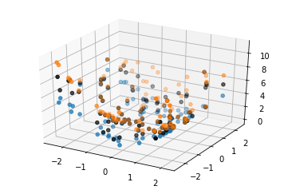

# PyIPM
## Jonathan Sadeghi, University of Liverpool, 2018

[](https://travis-ci.org/JCSadeghi/PyIPM)

This code is a port of the MATLAB Interval Predictor Model class from the OpenCossan generalised uncertainty quantification software. The code was tested in Python 2.7.
This version of the code is significantly simplified. If the model obtained is too conservative for your requirements then you may wish to download [OpenCossan](http://www.cossan.co.uk), which is freely available after registration. The MATLAB version of the code contains many optimisations to improve the performance of the models.

[More information about my work on the Cossan Interval Predictor Model Code](https://personalpages.manchester.ac.uk/staff/jonathan.sadeghi/blog/2018/math/index.html)

[More information about what this toolbox actually does](https://www.researchgate.net/publication/317598944_COSSAN_SOFTWARE_A_MULTIDISCIPLINARY_AND_COLLABORATIVE_SOFTWARE_FOR_UNCERTAINTY_QUANTIFICATION)

If you find the toolbox useful for your research and decide to use it in a paper we kindly request that you cite the following paper:

[E Patelli, M Broggi, S Tolo, J Sadeghi, Cossan Software: A Multidisciplinary And Collaborative Software For Uncertainty Quantification, UNCECOMP 2017, At Rhodes Island, Greece, 2nd ECCOMAS Thematic Conference on Uncertainty Quantification in Computational Sciences and Engineering, June 2017.](https://www.researchgate.net/publication/317598944_COSSAN_SOFTWARE_A_MULTIDISCIPLINARY_AND_COLLABORATIVE_SOFTWARE_FOR_UNCERTAINTY_QUANTIFICATION)

The code requires the cvxopt package (pip install cvxopt), sklearn and numpy.

### Tutorial

Here is a brief demonstration of the code:

First import the required dependencies:

```python
import numpy as np
from PyIPM import PyIPM
```

Construct an Interval Predictor Model:

```python
model = PyIPM(polynomial_degree=2)
```

Sample 100 realisations from an arbitrary function to emulate training data. Two input features and one output:
```python
x = 5 * (np.random.rand(100, 2) - 0.5)
y = x[:, 0] ** 2 + x[:, 1] ** 2 * np.random.rand(1, 100)
```

Fit the model to the training data:
```python
model.fit(x, y[0, :])
```

Get upper and lower bound of model on the training data set:
```python
upper_bound, lower_bound = model.predict(x)
```

Plot the training data with the model predictions:
```python
import matplotlib.pyplot as plt
from mpl_toolkits.mplot3d import Axes3D
fig = plt.figure()
ax = fig.add_subplot(111, projection='3d')
ax.scatter(x[:, 0], x[:, 1], y, color='black')
ax.scatter(x[:, 0], x[:, 1], lower_bound[:, 0])
ax.scatter(x[:, 0], x[:, 1], upper_bound[:, 0])
fig
```



The fake training data is plotted in black. The upper bound predicted by our model is shown in yellow, and the lower bound is shown in blue.

```python
model.get_model_reliability()
```

0.8811879999998812

This means that, for a test set generated from the same function as the training data, our model predictions will be enclose the test set with probability greater than 0.88. Note that in this case the model we have given is very conservative - an improved model with smaller prediction interval and higher coverage probability is available in the [OpenCossan](http://personalpages.manchester.ac.uk/staff/jonathan.sadeghi/codes.htm) version of the code.
